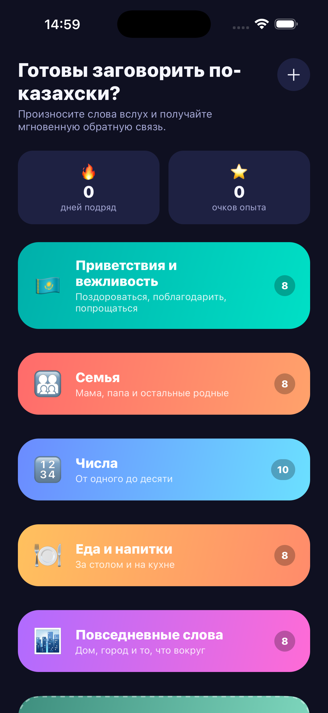
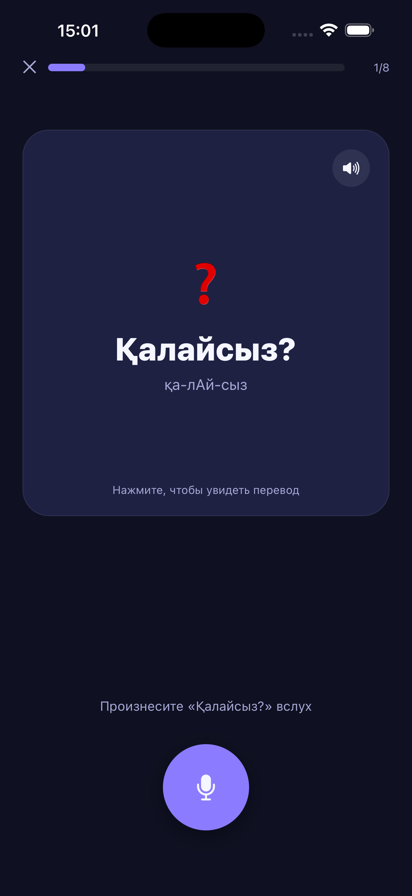
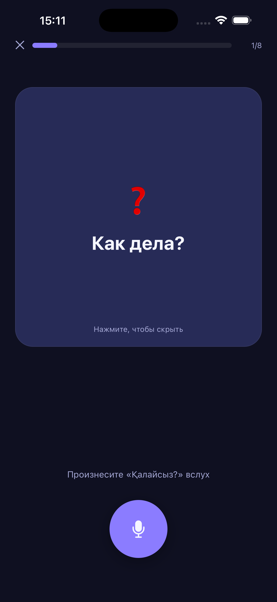
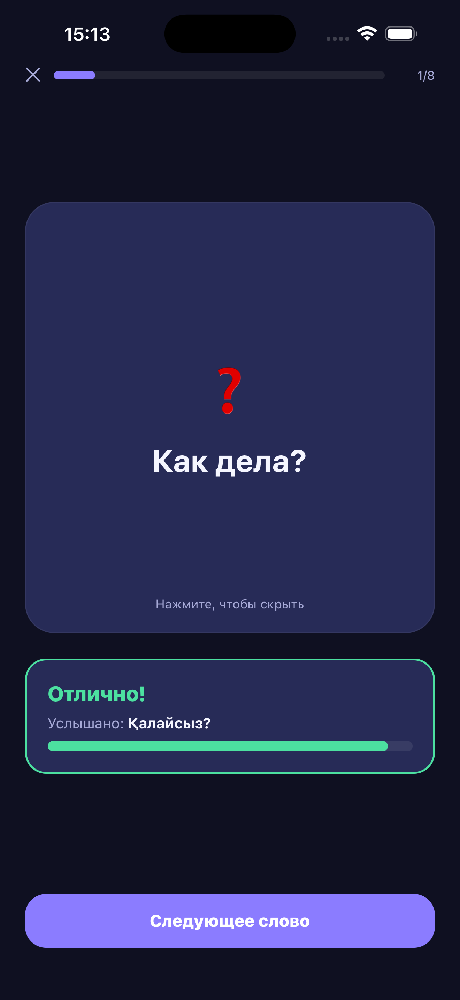

<div align="center">

# Сөйле

**Учи казахский — говори вслух.** Практика произношения казахских слов с мгновенной AI-оценкой.

[Русский](#русский) · [English](#english)

</div>

   

---

## Русский

**Сөйле** — мобильное приложение для русскоговорящих, изучающих казахский язык. Вместо простого заучивания слов приложение учит произносить их вслух: вы видите карточку со словом, произносите его в микрофон, а приложение с помощью распознавания речи мгновенно говорит, правильно ли вы это сделали.

### Возможности

- 🎙️ **Оценка произношения** — запись голоса и сравнение с эталоном через ASR (распознавание речи)
- 🔊 **Озвучка слов** — синтез речи для эталонного произношения любой карточки
- 🧠 **Интервальное повторение** — система Лейтнера подбирает карточки по мере их запоминания
- 🔥 **Геймификация** — опыт (XP), серия дней подряд, комбо за правильные ответы
- ✏️ **Свои карточки** — добавляйте, редактируйте и удаляйте собственные слова
- 🌗 **Тёмная тема**, адаптивный веб-интерфейс

### Технологии

- [Expo](https://expo.dev) / React Native (iOS, Android, Web)
- [NCSpeech Studio](https://studio.ncspeech.ai) — распознавание и синтез казахской речи
- Прокси-сервер на [Cloudflare Workers](https://workers.cloudflare.com) (`server/`) — скрывает API-ключ от клиента
- Локальное хранилище прогресса через `AsyncStorage`, без аккаунтов и серверной базы данных

### Быстрый старт

```bash
npm install
npm start          # затем откройте в Expo Go, симуляторе iOS/Android или в браузере
```

Для полной работы распознавания речи в `.env` нужен адрес прокси-сервера:

```
EXPO_PUBLIC_PROXY_BASE_URL=https://your-proxy.workers.dev
```

Без него приложение работает в демо-режиме: распознавание речи имитируется случайным образом, а озвучка слов идёт через встроенный синтезатор речи устройства.

Исходники самого прокси-сервера — в `server/`, разворачиваются через [Wrangler](https://developers.cloudflare.com/workers/wrangler/) (`npm run deploy` внутри `server/`).

### Конфиденциальность

Голосовые записи используются только для проверки произношения и не хранятся приложением. Подробности — в [политике конфиденциальности](https://claude.ai/code/artifact/88fef1d6-f392-40d3-990b-354940d4ac8d).

---

## English

**Сөйле** ("Speak" in Kazakh) is a mobile app for Russian-speaking learners of Kazakh. Instead of just memorizing words, it teaches you to actually say them: you see a card with a word, speak it into the microphone, and the app uses speech recognition to instantly tell you whether your pronunciation was right.

### Features

- 🎙️ **Pronunciation scoring** — records your voice and compares it to the target word via ASR (speech recognition)
- 🔊 **Word playback** — text-to-speech for the reference pronunciation of any card
- 🧠 **Spaced repetition** — a Leitner-box system resurfaces cards based on how well you know them
- 🔥 **Gamification** — XP, daily streaks, combo bonuses for consecutive correct answers
- ✏️ **Custom cards** — add, edit, and delete your own vocabulary
- 🌗 **Dark theme**, responsive web layout

### Tech stack

- [Expo](https://expo.dev) / React Native (iOS, Android, Web)
- [NCSpeech Studio](https://studio.ncspeech.ai) — Kazakh speech recognition and synthesis
- A [Cloudflare Workers](https://workers.cloudflare.com) proxy (`server/`) — keeps the API key off the client
- Progress stored locally via `AsyncStorage` — no accounts, no server-side database

### Getting started

```bash
npm install
npm start          # then open in Expo Go, an iOS/Android simulator, or a browser
```

Real speech recognition needs a proxy URL in `.env`:

```
EXPO_PUBLIC_PROXY_BASE_URL=https://your-proxy.workers.dev
```

Without it, the app runs in demo mode: speech recognition is simulated randomly, and word playback falls back to the device's built-in speech synthesizer.

The proxy server's source lives in `server/`, deployed via [Wrangler](https://developers.cloudflare.com/workers/wrangler/) (`npm run deploy` inside `server/`).

### Privacy

Voice recordings are used only to check pronunciation and aren't stored by the app. See the [privacy policy](https://claude.ai/code/artifact/88fef1d6-f392-40d3-990b-354940d4ac8d) for details.

---

<div align="center">

MIT License

</div>
